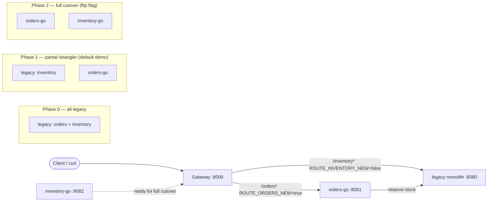

# strangler-lab

**Strangler Fig lab** — migrate a legacy monolith to Go microservices with gateway cutover and contract tests.

> Lab project exploring patterns used when modernizing long-lived enterprise retail systems (monolith → services).  
> **Not a real POS.** Clean-room educational code only. Author: [Aniket Singh](https://github.com/an1ket-s1ngh) · MIT

[](https://go.dev/)
[](https://nodejs.org/)
[](LICENSE)

---

## The problem

Long-lived retail backends often start as a single process that owns **orders, inventory, pricing, and more**. That works until release risk, scaling pressure, and team boundaries force a change. A big-bang rewrite is rarely safe: you cannot freeze the business while you rebuild everything.

The **Strangler Fig** pattern (Martin Fowler) grows new services around the old system and **routes traffic slice by slice** until the monolith can be retired. This repo is a tiny, runnable demo of that idea.

Domain (toy only): **retail orders + inventory**.

---

## Architecture



| Process | Port | Role |
|---------|------|------|
| **gateway** | `8000` | Path-based cutover router + feature flags |
| **legacy** | `8080` | Node “monolith”: orders + inventory in one process |
| **orders-go** | `8081` | Go orders microservice (default cutover target) |
| **inventory-go** | `8082` | Go inventory microservice (built; not routed by default) |

**Default demo routing**

- `POST/GET /orders*` → **orders-go**
- `GET/POST /inventory*` → **legacy**
- `orders-go` still reserves stock by calling **legacy** inventory (realistic partial extract)

Flip cutover without redeploying clients:

```bash
ROUTE_ORDERS_NEW=true
ROUTE_INVENTORY_NEW=false   # set true to send inventory to inventory-go
```

Inspect live routing:

```bash
curl -s http://127.0.0.1:8000/__routes | jq .
curl -s http://127.0.0.1:8000/health | jq .
```

---

## How this maps to real-world retail modernization

Without naming any employer or product line, the same moves show up when modernizing long-lived store / order backends:

| Lab concept | Real-world analogue |
|-------------|---------------------|
| Monolith owning orders + stock | Single deployable retail core |
| Shared OpenAPI + contract tests | Consumer-driven / schema contracts before cutover |
| Gateway path flags | Edge routing, feature flags, or service mesh traffic split |
| Extract orders first | Highest-change domain peeled off while inventory stays put |
| New service still calls old inventory | Temporary anti-corruption / façade dependency during migration |
| `X-Served-By` response header | Observability so you can prove which backend answered |

What a recruiter or hiring manager should notice:

1. **Pattern fluency** — strangler fig, not rewrite theatre  
2. **Contract-first cutover** — same request/response shapes on both sides  
3. **Working Go microservices** — modules, `net/http` routing, tidy deps  
4. **Operational honesty** — smoke script, health endpoints, config-driven routing  
5. **Communication** — README + mermaid that explain *why*, not only *what*

---

## Quick start

**Prerequisites:** Go 1.22+, Node 18+, Make (optional).

```bash
git clone https://github.com/an1ket-s1ngh/strangler-lab.git
cd strangler-lab

# One-shot: build, start stack, create-order flow, tear down (exit 0 on pass)
make smoke
# or
node scripts/smoke.js --start
```

Foreground stack for exploration:

```bash
make up
# another terminal:
node scripts/smoke.js
curl -s http://127.0.0.1:8000/__routes
```

Contract tests (legacy vs `orders-go` against the shared orders shape):

```bash
make contract
# or
cd contracts && npm test
```

Docker (optional):

```bash
docker compose up --build
# then: node scripts/smoke.js   # GATEWAY_URL defaults to :8000
```

---

## Manual happy path

```bash
# Inventory still on legacy
curl -s http://127.0.0.1:8000/inventory/SKU-COFFEE-01 | jq .

# Create order — gateway sends this to orders-go
curl -s -X POST http://127.0.0.1:8000/orders \
  -H 'content-type: application/json' \
  -d '{"customerId":"cust-42","items":[{"sku":"SKU-COFFEE-01","quantity":2}]}' | jq .

# Fetch order
curl -s http://127.0.0.1:8000/orders/<id> | jq .
```

Response headers tell the story:

- `X-Served-By: orders-go` or `legacy-monolith`
- `X-Gateway-Target: http://127.0.0.1:8081` (upstream base the gateway chose)

---

## Layout

```
/legacy              Node monolith (orders + inventory, in-memory)
/services/orders-go  Go orders API (calls inventory for reserve)
/services/inventory-go  Go inventory API (second slice)
/gateway             Go edge router + cutover flags
/contracts           OpenAPI 3 + Node contract tests
/scripts             dev-up + smoke
docker-compose.yml   optional multi-container stack
Makefile             build / up / smoke / contract
```

---

## API sketch

| Method | Path | Body / notes |
|--------|------|----------------|
| `GET` | `/health` | liveness |
| `POST` | `/orders` | `{ "customerId", "items":[{ "sku", "quantity" }] }` → `201` Order |
| `GET` | `/orders/:id` | Order or `404` |
| `GET` | `/inventory/:sku` | Stock or `404` |
| `POST` | `/inventory/:sku/reserve` | `{ "quantity" }` → reserved / remaining |

Full schema: [`contracts/openapi.yaml`](contracts/openapi.yaml).

Seed SKUs: `SKU-COFFEE-01`, `SKU-MUG-12`, `SKU-FILTER-100`.

---

## Cutover playbook (demo)

1. **Phase 0** — all traffic to legacy (`ROUTE_ORDERS_NEW=false`, `ROUTE_INVENTORY_NEW=false`).  
2. **Phase 1 (default)** — extract orders; inventory stays; contracts green.  
3. **Phase 2** — start `inventory-go`, set `ROUTE_INVENTORY_NEW=true`, point `orders-go` `INVENTORY_URL` at it, re-run smoke.  
4. **Phase 3** — delete unused legacy handlers once traffic and metrics agree.

That sequence is the whole point of the lab: **incremental, reversible, contract-guarded**.

---

## Design notes

- In-memory stores only — no DB, no Kubernetes, no message bus.  
- Errors are JSON `{ "error": "..." }` with stable HTTP status codes (`400` / `404` / `409`).  
- Go code uses the standard library (`net/http` path patterns) plus `google/uuid` for order IDs.  
- Contract tests boot legacy + `orders-go` themselves so CI does not need Docker.

---

## License

MIT © Aniket Singh — see [LICENSE](LICENSE).

Topics: `go` · `microservices` · `strangler-fig` · `modernization` · `architecture` · `contract-testing`
